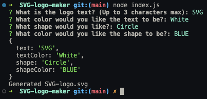

# SVG Logo Maker
  
  
  ##### Table of Contents  
  [Description](#description)  
  [Installation](#installation)  
  [Usage](#usage)  
  [Contributions](#contributions)  
  [Tests](#tests)  
  [Questions](#questions)  
  [License](#license)  

  ## Description  
  This project was created to help users create simple logo designs for their projects. The application allows the user to generate their own logo through CLI prompts. The logo is generated through the use of Inquirer to gather the user's prompts in the terminal, and by utilizing shape classes that take those prompts and render a logo.

  ## Installation  
  Run the following command to install the required dependencies.
  ```
  npm i 
  ```
  

  ## Usage  
  To use the application run the command 'node index.js'. Answer the four CLI prompts. Once all prompts have been answered, a svg file will be created in the examples folder.  
  
  

  ## Video Demo


  ## Contributions  
  Github user [Reinis Ivanovs](https://github.com/slikts): [CSS Color Array](https://gist.github.com/slikts/cfa5bb0ad340b6e01dd711f20a419aec)

  ## Tests  
  Run the following command to run tests using jest. 
  ```
  npm test
  ```

  The shapes.test.js file is a testing suite for the render() methods of the individual shape classes.


  ## Questions
  For any questions regarding the repository, contact me via:
  * Github: [dgomie](https://www.github.com/dgomie)
  * Email: <a href="mailto:danny.f.gomez@gmail.com">danny.f.gomez@gmail.com</a>
  
  ## License
    
   
